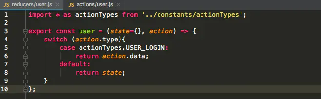

# react

react 相关技术栈

<!-- more -->

## create-react-app 修改 webpack

1. 安装插件

```
yarn add antd babel-plugin-import less less-loader@^7.3.0
```

2. 编写使用 less

```js
    {
        test: lessRegex,
        exclude: lessModuleRegex,
        use: getStyleLoaders(
            {
                importLoaders: 3,
                sourceMap: isEnvProduction
                ? shouldUseSourceMap
                : isEnvDevelopment,
            },
            'less-loader',
            {
                lessOptions: { javascriptEnabled: true.valueOf, modifyVars: { '@primary-color': '#1DA57A' } }, // babel-plugin-import 配置完
            }
        ),
        sideEffects: true,
    },
    {
        test: lessModuleRegex,
        use: getStyleLoaders(
        {
            importLoaders: 3,
            sourceMap: isEnvProduction
            ? shouldUseSourceMap
            : isEnvDevelopment,
            modules: {
                getLocalIdent: getCSSModuleLocalIdent,
            },
        },
        'less-loader'
        ),
    },
```

3. 编写 babel-plugin-import 配置

```js
// 1.修改getStyleLoaders方法
  const getStyleLoaders = (cssOptions, preProcessor, preProcessorOptions = {}) => {
    // something
    if (preProcessor) {
      loaders.push(
        // something
        {
          loader: require.resolve(preProcessor),
          options: {
            sourceMap: true,
            ...preProcessorOptions
          },
        }
      );
    }
    return loaders;
  };
// 2. 修改rules
    {
        test: /\.(js|mjs|jsx|ts|tsx)$/,
        options: {
            plugins: [
                ['import',
                    {
                        libraryName: 'antd',
                        libraryDirectory: 'es',
                        style: true
                    }
                ]
            ].filter(Boolean),
        }
    }
```

# React Router

## HashRouter、BrowserRouter

## Route 用法

### V5

```jsx
<Route path='/admin/ui/buttons' component={Buttons} />
<Route path='/admin/ui/modals' component={Modals} />
<Route path='/admin' render={()=>{
    <Admin>
        <Route path='/admin/home' component={Home} />
    </Admin>
}} />
// Link
<Link to='/'>Home</Link>
<Link to={{pathname:'/three/7'}}>Three #7</Link>
// 定义 <Route path='/three/:number' /> 取值：this.prosp.match.params.number
// Switch 精准匹配第一个
// exact 完全匹配
<Switch>
    <Route path='/admin/ui/buttons' component={Buttons} />
    <Route exact path='/admin/ui/modals' component={Modals} />
    <Route component={noMatch} />
</Switch>
// Redirect
<Redirect to='/admin/home' />
```

### V6

[React-Router v6 新特性解读及迁移指南](https://blog.csdn.net/weixin_40906515/article/details/104957712)

## React 新特性简介及 context 的使用

- Context
- ContextType
- lazy/Suspense
- memo

### Context

`<Provider>` `<Consumer>` 多个 Context 嵌套使用

```js
import { Component, createContext } from "react";
const BatteryContext = createContext();

<BatteryContext.Provider value={60}>
  <Middle />
</BatteryContext.Provider>;

class Middle extends Component {
  render() {
    return <Leaf />;
  }
}

class Leaf extends Component {
  render() {
    return (
      <BatteryContext.Consumer>
        {(battery) => <h1>Battery:{battery}</h1>}
      </BatteryContext.Consumer>
    );
  }
}
```

### ContextType 渲染 jsx 之前提前获取 Consumer 的值

```js
const BatteryContext = createContext();
class Leaf extends Component {
  static contextType = BatteryContext; // 静态属性赋值
  render() {
    const battery = this.context; // 会自动生成context属性，值就是provider的值
    return <h1>Battery:{battery}</h1>;
  }
}
```

### lazy 和 Suspense 运行性能 api

```js
import { lazy, Suspense } from "react"; // Suspense异步渲染空挡显示
const About = lazy(() => import(/* webpackChunkName: "about" */ "./About.jsx"));
// ErrorBoundary 错误边界，当About加载失败的时候
// componentDidCatch
class App extends Component {
    state = {
        hasError=false
    }
    componentDidCatch() { // 原始写法
        this.setState({
            hasError:true
        })
    },
    static getDerivedStateFromError(){ // 精简写法，发现错误直接将返回值合并到state
        return {
            hassError:true
        }
    }
  render() {
      if(this.state.hasError){
          return <div>error</div>
      }
    return (
      <div>
        <Suspense fallback={<div>loading</div>}>
          <About />
        </Suspense>
      </div>
    );
  }
}
```

# React Hooks 初始应用版本 16.8

> 类组件、函数组件  
> 类组件复用 渲染属性、高阶组件

## 类组件不足

1. 缺少复用机制
1. 渲染属性和高阶组件导致层级冗余
1. 生命周期函数混杂不相干逻辑
1. 相关逻辑分散在不同生命周期

```js
// 渲染属性
class Resizeable extends Component {
  state = {
    size: [window.innerWidth, window, innerHeight],
  };
  onResize = () => {
    this.setState({
      size: [window.innerWidth, window, innerHeight],
    });
  };
  componentDidMount() {
    window.addEventListener("resize", this.onResize);
  }
  componentWillUnMount() {
    window.removeEventListener("resize", this.onResize);
  }
  render() {
    return this.props.render(this.props.size);
  }
}
class Foo extends Component {
  render() {
    const [width, height] = this.props.size;
    return (
      <div>
        {width}*{height}
      </div>
    );
  }
}

<Resizeable render={(size) => <Foo size={size} />} />;

// 高阶组件
function resizeable(Child) {
  return class Wrapper extends Component {
    state = {
      size: [window.innerWidth, window, innerHeight],
    };
    onResize = () => {
      this.setState({
        size: [window.innerWidth, window, innerHeight],
      });
    };
    componentDidMount() {
      window.addEventListener("resize", this.onResize);
    }
    componentWillUnMount() {
      window.removeEventListener("resize", this.onResize);
    }
    render() {
        const size=this.props.zise
      return <Child size={size} />
    }
  };
}

class Foo extends Component {
  render() {
    const [width, height] = this.props.size;
    return (
      <div>
        {width}*{height}
      </div>
    );
  }
}

const WrapperedFoo = resizeable(Foo)
<WrapperedFoo />
```

## Hooks 优势

1. 函数组件无 this 问题
1. 自定义 Hook 方便复用状态逻辑
1. 副作用的关注点分离

### useSate 数据状态

```js
function App(props) {
  const [count, setCount] = useState(() => props.defaultCount || 0);
  return <button onClick={() => setCount(count + 1)}>Click{count}</button>;
}
```

### useEffect 生命周期函数

1. 第二个参数，不传数组，每次都执行
1. 空数组，每次都相同只执行一次
1. 数组每一项都不变，useEfect 才不会执行

```js
function App(props) {
  const [count, setCount] = useState(0);
  const [size, setSize] = useState({
    width: document.docmentElement.clientWidth,
    height: document.docmentElement.clientHeight,
  });
  const onResize = () => {
    setSize({
      width: document.docmentElement.clientWidth,
      height: document.docmentElement.clientHeight,
    });
  };
  useEffect(() => {
    document.title = count;
  });
  useEffect(() => {
    window.addEventListener("resize", onResize, false);
    return () => {
      window.removeEventListener("resize", onResize, false);
    };
  }, []);
  return (
    <h1>
      size: {size.width} x {size.height}
    </h1>
  );
}
```

### useContext

函数组件使用 context 简单方式

```js
import { useContext, createContext } from "react";
const CountContext = createContext();
const count = useContext(CountContext);
```

### useMemo & useCallback

1. mome 优化组件重新渲染的行为，类似于 PureComponent
1. useMemo 一段函数是否重复执行
1. 与 useEffect 的区别，useEffect 渲染完成后执行，useMemo 渲染期间完成有返回值
1. useMemo(()=>fn) === useCallback(fn)

```js
const [count, setCount] = useState(0);
const double = useMemo(() => {
  return count * 2;
}, [count === 3]); // 值变化三次，所以double，为0，6，8

const Counter = memo(function Counter(props) {
  console.log("Counter render");
  return <h1 onClick={props.onClick}>{props.count}</h1>;
});
const onClick = useMemo(()=>{
    return ()=>{
        console.log('click')
    }
},[])
const onClick = useCallback(()=>{
        console.log('click')
},[])

<Counter count={double} onClick={onClick} />;
```

### useRef

> 特性

1. 获取 dom 时，只能使用在类组件上
2. 函数组件不能完全替代类组件

> 作用

1. 获取 dom
1. 同步不同渲染周期之间的数据

```js
import { useRef, useEffect } from "react";
function App(props) {
  const counterRef = useRef();
  const it = useRef();

  useEffect(() => {
    it.current = setInterval(() => {
      setCount((count) => count + 1);
    }, 1000);
  }, []);
  useEffect(() => {
    if (count >= 10) {
      clearInterval(it.current);
    }
  });
  return (
    <div>
      <Counter ref={counterRef}></Counter>
    </div>
  );
}
```

### Custom Hooks 自定义 Hooks

```js
import { useState, useRef, useEffect } from "react";
function useCounter(count) {
  return <h1>{count}</h1>;
}

function useCount(defaultCount) {
  const [count, setCount] = useState(defaultCount);
  const it = useRef();

  useEffect(() => {
    it.current = setInterval(() => {
      setCount((count) => count + 1);
    }, 1000);
  }, []);
  useEffect(() => {
    if (count >= 10) {
      clearInterval(it.current);
    }
  });
  return [count, setCount];
}

function App(props) {
  const [count, setCount] = useCount(0);
  const Counter = useCounter(count);
  return <div>{Counter}</div>;
}
```

## 使用法则

1. 顶层使用
1. 只在函数组件或自定义 hooks 中调用 hooks 函数

# PWA

> service worker

服务工作线程

1. 常驻内存运行
1. 代理网络请求
1. 依赖 https

```js
// 注册
navigator.serviceWorker.register("./sw.js", { scope: "/" }).then(
  (registration) => {
    console.log(registration);
  },
  (err) => console.log(err)
);
// sw.js
self.addEventListener("install", (event) => {
  console.log("install", event);
  event.waitUntil(self.skipWaiting()); // 安装并激活新的sw
});
self.addEventListener("activate", (event) => {
  console.log("activate", event);
  event.waitUntil(self.clients.claim()); // 使网站受到sw的控制
});
self.addEventListener("fetch", (event) => {
  console.log("fetch", event);
});
```

> web worker

> fetch

> Cache API

> Notification API

```js
// 通知权限状态
Notification.permission;
// 请求权限 必须在页面上下文中
Notification.requestPermission().then((permission) => console.log(permission));
// 发出通知 web
new Notification("hello notification", { body: "this is from console" });
// 发出通知 sw
self.registration.showNotification("hello notification", {
  body: "this is from sw",
});
```

`workbox` 集成化的 PWA

# Redux

## 添加依赖

1. yarn add redux react-redux redux-thunk react-router-dom  
   // redux-thunk 让 action 可以返回函数的中间件
2. yarn add redux-logger --dev  
   //辅助 redux，可在打印中看到 redux 一切行为和数据

## 创建项目目录结构


## 配置 Redux（<font color=#ff0000>文件具体路径请看项目目录结构</font>）

1. actionTypes 公用属性  
   

2. 添加一个 action  
   

3. 写入与 action 对应的 reducer  
   

4. 合并 reducer ，便于处理 reducer 过多导致的麻烦  
   

5. 配置 store  
   

6. 将 store 写入启动程序中  
   

## 配置路由


# @redux/toolkit

1. 初始化 store.js

```js
// store.js
import { configureStore } from "@reduxjs/toolkit";
import counterReducer from "../features/counter/counterSlice";

export const store = configureStore({
  reducer: {
    counter: counterReducer,
  },
});
```

2. 编写 reducer 切片

```js
// counterSlice.js
import { createAsyncThunk, createSlice } from "@reduxjs/toolkit";
import { fetchCount } from "./counterAPI";

// 默认State
const initialState = {
  value: 0,
  status: "idle", // 异步状态
};

// 异步action
export const incrementAsync = createAsyncThunk(
  "counter/fetchCount",
  async (amount) => {
    const response = await fetchCount(amount);
    return response.data;
  }
);

// 创建切片
export const counterSlice = createSlice({
  name: "counter",
  initialState,
  reducers: {
    // 同步
    increment: (state) => {
      state.value += 1;
    },
    decrement: (state) => {
      state.value -= 1;
    },
    incrementByAmount: (state, action) => {
      state.value += action.payload;
    },
  },
  extraReducers: (builder) => {
    // 异步
    builder
      .addCase(incrementAsync.pending, (state) => {
        state.status = "loading";
      })
      .addCase(incrementAsync.fulfilled, (state, action) => {
        state.status = "idle";
        state.value += action.payload;
      });
  },
});

// 暴露actions
export const { increment, decrement, incrementByAmount } = counterSlice.actions;

// 暴露state
export const selectCount = (state) => state.counter.value;

// 同步方法
export const incrementIfOdd = (amount) => (dispatch, getState) => {
  const currentValue = selectCount(getState());
  if (currentValue % 2 === 1) {
    dispatch(incrementByAmount(amount));
  }
};

export default counterSlice.reducer;

// counterAPI.js
export function fetchCount(amount = 1) {
  return new Promise((resolve) =>
    setTimeout(() => resolve({ data: amount }), 500)
  );
}
```

3. 使用

```js
// index.js
import React from "react";
import ReactDOM from "react-dom";
import "./index.css";
import App from "./App";
import { store } from "./app/store";
import { Provider } from "react-redux";

ReactDOM.render(
  <React.StrictMode>
    <Provider store={store}>
      <App />
    </Provider>
  </React.StrictMode>,
  document.getElementById("root")
);
// Counter.js
import React, { useState } from "react";
import { useSelector, useDispatch } from "react-redux";
import {
  decrement,
  increment,
  incrementByAmount,
  incrementAsync,
  incrementIfOdd,
  selectCount,
} from "./counterSlice";
import styles from "./Counter.module.css";

export function Counter() {
  const count = useSelector(selectCount);
  const dispatch = useDispatch();
  const [incrementAmount, setIncrementAmount] = useState("2");

  const incrementValue = Number(incrementAmount) || 0;

  return (
    <div>
      <div className={styles.row}>
        <button
          className={styles.button}
          aria-label="Decrement value"
          onClick={() => dispatch(decrement())}
        >
          -
        </button>
        <span className={styles.value}>{count}</span>
        <button
          className={styles.button}
          aria-label="Increment value"
          onClick={() => dispatch(increment())}
        >
          +
        </button>
      </div>
      <div className={styles.row}>
        <input
          className={styles.textbox}
          aria-label="Set increment amount"
          value={incrementAmount}
          onChange={(e) => setIncrementAmount(e.target.value)}
        />
        <button
          className={styles.button}
          onClick={() => dispatch(incrementByAmount(incrementValue))}
        >
          Add Amount
        </button>
        <button
          className={styles.asyncButton}
          onClick={() => dispatch(incrementAsync(incrementValue))}
        >
          Add Async
        </button>
        <button
          className={styles.button}
          onClick={() => dispatch(incrementIfOdd(incrementValue))}
        >
          Add If Odd
        </button>
      </div>
    </div>
  );
}
```
